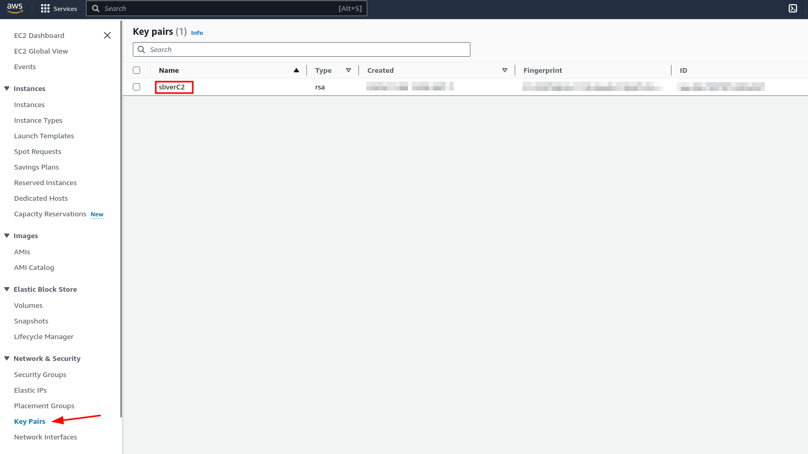

Terraform error are usually pretty verbose but this are some of the most common mistakes I encounter when building this:


### 1. Key pair creation in amazon and reference in variables.tf

Whichever name your key has in the variable "ssh-key-name" has to match the name in your AWS keypair and make sure you have that .pem file. You will need it to access.

```bash
variable "ssh-key-name" {
  description = "Name of the SSH keypair to use in AWS"
  type        = string
  default     = "sliverC2"
}
```




### 2. Allow acccess your ip at home in the variables.tf

```bash 
variable "sg_cidr_blocks_allow_ssh" {
  description = "The CIDR blocks of the security group"
  type        = list(string)
  default     = [""]
}
variable "sg_cidr_blocks_allow_http" {
  description = "The CIDR blocks of the security group"
  type        = list(string)
  default     = [""]
}
variable "sg_cidr_blocks_allow_https" {
  description = "The CIDR blocks of the security group"
  type        = list(string)
  default     = [""]
}
```